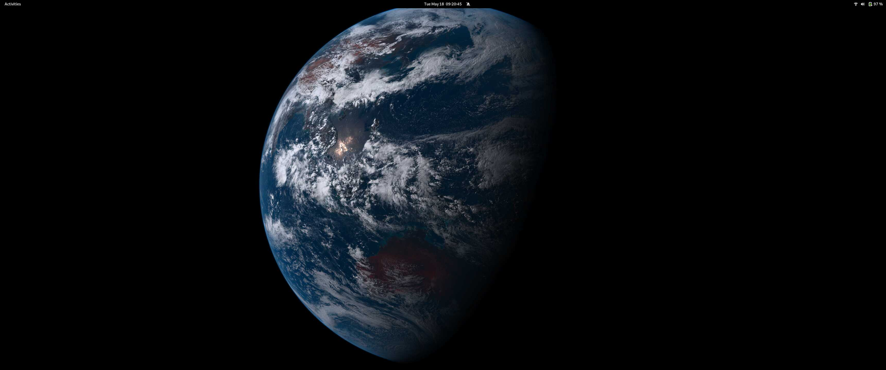

# LiveEarth

Get a live view of the earth on your desktop:



## Usage:

To download and set a single image as background:

```
./bg.sh
```

To update the picture regularly (currently with systemd):

```
./install.sh
```

## Dependencies

`imagemagick`, `curl`, `xargs`.

On non-gnome linux: `feh`

## Acknowledgement

Works on many Linux distributions and Mac OS thanks to [@bcelenza](https://github.com/bcelenza).
